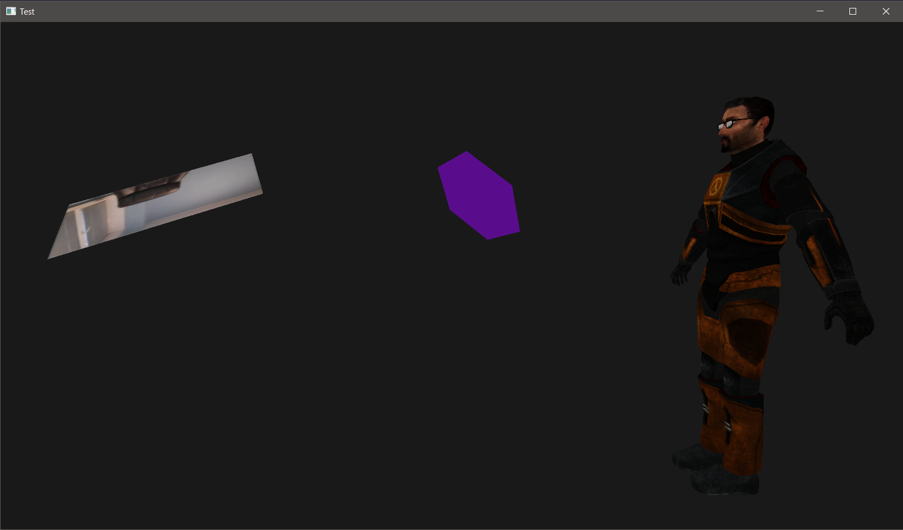

# OpenGL game(?) engine using ECS (Entity component system)
Continuation of my OpenGL studying.  
Decided to rewrite my previous works (private repos) in more modern style, using better pattern ECS as this project would be easier to edit, cause of modularity. Comments will be added as this project will be more and more complex.

# Required TODOs:
- Improve model loading (solve texture flipping on some models, support for more materials, textures, PBR)
- Improve resource manager
- Add render system
- Add simplest lightning system
- Add cubemaps

# Future plans:
- Particle system
- Audio
- GUI (Entities explorer, Resources explorer and etc.)
- Bone animation
- Physics (will be used external library)
- Advanced lightning system
- Shadow mapping
- Dynamic lightning count
- Scripting (maybe lua, not decided)

# Images:

